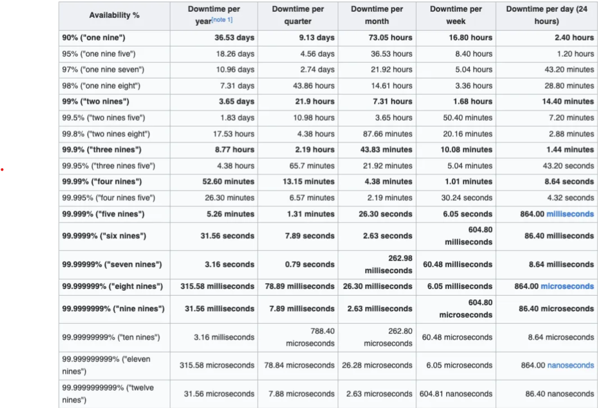

# Key Principles of a SRE
## Reliability
- Reliability is a core principle of SRE, often described as the measure of a system's ability to perform its intended function without failure, within an acceptable time frame, and under expected conditions.It's a multifaceted concept encompassing several key aspects:   

1. **Availability:** This is the most straightforward aspect, referring to the system's ability to be up and running when users need it. It's often measured using metrics like uptime percentages. 
Calculate availability: Availability = (Uptime / (Uptime + Downtime)) * 100%
  

2. **Latency:** This refers to the time it takes for a system to respond to a user request. Low latency is crucial for a good user experience, especially in applications like e-commerce or online gaming. 
Calculate average latency: Average Latency = Sum of all response times / Number of requests
  

3. **Throughput:** This measures the system's capacity to handle a certain volume of requests or data. A reliable system can handle peak loads without significant performance degradation.  
Calculate throughput: Throughput = Data processed / Time taken or Throughput = Number of requests / Time taken   

4. **Error Rate:** This indicates the frequency of errors or failures within the system. A low error rate is essential for maintaining a stable and predictable service.   

5. **Recoverability:** This refers to the system's ability to quickly recover from failures or disruptions. This includes mechanisms like failover, redundancy, and automated recovery procedures.   

6. **Change Failure Rate:** This measures the frequency of service disruptions caused by changes to the system, such as software updates or infrastructure modification

Example:
Let's say a web server is operational for 23 hours and 55 minutes out of a 24-hour day. It handles 10,000 requests in an hour, with an average response time of 200 milliseconds. The server processes 50 gigabytes of data in the same hour.

Availability:
Uptime: 23 hours 55 minutes = 1435 minutes
Downtime: 5 minutes
Availability = (1435 / (1435 + 5)) * 100% ≈ 99.65%

Latency:
Average Latency = 200 milliseconds = 0.2 seconds

Throughput:
Requests: 10,000 requests / hour
Data: 50 gigabytes / hour
## SLI, SLO, SLA and Error Budgets
* **SLI(Service Level Indicators):**  is a measurable metric that reflects the performance of a service. It's the what we're measuring. SLIs answer the question: How well is the service performing?

    Example: Availability, Latency, Throughput, Error rate, Success rate etc

* **SLO(Service Level Objective)**  A target value for an SLI. It's the how well we want the service to perform.

    Example:
    
    Availability SLO: "Our website should be available at least 99.9% of the time."
    
    Latency SLO: "The average response time of our API should be less than 200 milliseconds."
    
    Error Rate SLO: "The error rate should not exceed 0.1%."

* **SLA(Service Level Agreement)**  A legally binding contract between a service provider and its customers that guarantees a certain level of service performance. It's the commitment to the customer.
    
    Example:
    
    "We guarantee 99.99% availability for our cloud storage service."
    
    "If the service availability falls below 99.99%, we will provide a credit to the customer."
    
    SLAs are often tied to financial penalties if the agreed-upon service levels are not met.
* **Error Budgets** The amount of deviation allowed from an SLO before it is considered violated. It's the wiggle room within the SLO.
    
    Example: To better understand Error Budgets consider, we have defined:
    
    SLA as 95% availability.
    
    SLO as 99% availability.
    
    First, let’s calculate the total allowed downtime for both:

   **Total Allowed Downtime for SLA (95% Availability)**

    Yearly: 365 days × 5% = 18.25 days/year

    Monthly: 30 days × 5% ≈ 1.5 days/month
    
    Weekly: 7 days × 5% = 0.35 days/week ≈ 8.4 hours/week
    
    Daily: 24 hours × 5% = 1.2 hours/day
    
    **Total Allowed Downtime for SLO (99% Availability)**

    Yearly: 365 days × 1% = 3.65 days/year

    Monthly: 30 days × 1% = 0.3 days/month ≈ 7.2 hours/month

    Weekly: 7 days × 1% = 0.07 days/week ≈ 1.68 hours/week

    Daily: 24 hours × 1% = 14.4 minutes/day

    Now, the error budget is the difference between the SLA and SLO downtime’s:

    Yearly Error Budget: 18.25 days (SLA) — 3.65 days (SLO) = 14.6 days/year

    Monthly Error Budget: 1.5 days (SLA) — 7.2 hours (SLO) ≈ 1.2 days/month

    Weekly Error Budget: 8.4 hours (SLA) — 1.68 hours (SLO) ≈ 6.72 hours/week

    Daily Error Budget: 1.2 hours (SLA) — 14.4 minutes (SLO) ≈ 1.04 hours/day

    This error budget represents the amount of additional downtime you can afford without breaching the SLA, given that you’re aiming to meet the SLO. It’s a buffer that allows for some level of imperfection in service delivery while still maintaining the overall agreement with the client or user.
    
    **Availability Calculations**

## Common Incident Management Metrics
**MTBF: Mean time between failures**  is the average time between repairable failures of a technology product. The metric is used to track both the availability and reliability of a product. The higher the time between failure, the more reliable the system.

The goal for most companies to keep MTBF as high as possible—putting hundreds of thousands of hours (or even millions) between issues.

MTBF is a metric for failures in **repairable** systems. For failures that require system replacement, typically people use the term MTTF (mean time to failure).

For example, think of a car engine. When calculating the time between unscheduled engine maintenance, you’d use MTBF—mean time between failures. When calculating the time between replacing the full engine, you’d use MTTF (mean time to failure).

**MTTR: Mean time to repair**  is the average time it takes to repair a system (usually technical or mechanical). It includes both the repair time and any testing time. The clock doesn’t stop on this metric until the system is fully functional again.

MTTR is a metric support and maintenance teams use to keep repairs on track. The goal is to get this number as low as possible by increasing the efficiency of repair processes and teams. 

**MTTR: Mean time to recovery**  (mean time to recovery or mean time to restore) is the average time it takes to recover from a product or system failure. This includes the full time of the outage—from the time the system or product fails to the time that it becomes fully operational again.

It's a key DevOps metric that can be used to measure the stability of a DevOps team, as noted by DevOps Research and Assessment (DORA).

**MTTR: Mean time to resolve** is the average time it takes to fully resolve a failure. This includes not only the time spent detecting the failure, diagnosing the problem, and repairing the issue, but also the time spent ensuring that the failure won’t happen again.

This metric extends the responsibility of the team handling the fix to improving performance long-term. It’s the difference between putting out a fire and putting out a fire and then fireproofing your house. 

**MTTR: Mean time to respond**  is the average time it takes to recover from a product or system failure from the time when you are first alerted to that failure. This does not include any lag time in your alert system.

**MTTF: Mean time to failure**  is the average time between non-repairable failures of a technology product. 
The calculation is used to understand how long a system will typically last, determine whether a new version of a system is outperforming the old, and give customers information about expected lifetimes and when to schedule check-ups on their system.

## Automation
Automation is a core principle of SRE, as it reduces manual effort and improves efficiency. SRE teams strive to automate routine tasks such as provisioning infrastructure, deploying software, and responding to incidents.

**Automation Tasks for SREs**

**Infrastructure provisioning** : Automating the setup of servers, networks, and other infrastructure components using tools like Terraform or Ansible. This ensures consistency and reduces manual errors.   

**Deployment and release management:** Automating the process of deploying code changes to production environments using tools like Jenkins or GitLab CI/CD. This enables faster and more frequent releases with reduced risk.   

**Scaling and resource management**: Automating the scaling of resources (e.g., CPU, memory) based on demand to optimize performance and cost. This can be achieved using tools like Kubernetes or AWS Auto Scaling.   

**Incident response:** Automating routine tasks during incidents, such as gathering diagnostic information, running automated checks, and executing predefined remediation steps. This speeds up response times and reduces the impact of outages.   

**Monitoring and alerting:** Automating the collection and analysis of system metrics, and triggering alerts based on predefined thresholds. This enables proactive identification and resolution of issues.   

Capacity planning: Automating the forecasting of future resource needs based on historical data and trends. This helps ensure that systems have sufficient capacity to meet demand.
## Monitoring and Alerting
Comprehensive monitoring and alerting systems are crucial for detecting and responding to incidents promptly. SRE teams use various tools and techniques to monitor system performance, identify anomalies, and trigger alerts when necessary.

**System metrics:** Monitoring key system metrics such as CPU utilization, memory usage, disk I/O, and network traffic.   

**Application performance metrics:** Monitoring application-specific metrics such as request latency, error rates, and throughput.   

**Log analysis:** Analyzing system and application logs to identify errors, anomalies, and other issues.   

**Synthetic monitoring:** Simulating user interactions to proactively identify and diagnose performance problems.

**Alerting systems:** Configuring alerting systems to notify the appropriate teams of critical issues, such as PagerDuty or Prometheus Alertmanager.

## Collaboration and Communication
SRE teams collaborate closely with product teams, development teams, and other stakeholders to ensure that systems are reliable, scalable, and aligned with business goals. Effective communication is essential for coordinating efforts and resolving issues.

